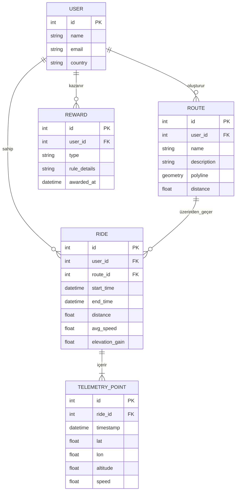

# Özet  
Motosiklet tutkunlarına yönelik, rota planlama, sürüş takibi ve ödül sistemlerini bir araya getiren “Strava benzeri” bir mobil uygulama geliştirme hedeflenmektedir. Bu uygulama, motosikletçilere sürüşlerini GPS ile kaydetme, ilgi çekici yolları keşfetme, toplulukla deneyim paylaşma ve sanal ödüller kazanma gibi özellikler sunacaktır. Aşağıdaki bölümlerde, ürün tanımı ve kullanıcı hikayeleri, rakip analizi, mimari önerileri, veri modeli, proje iskeleti, rota oluşturma, ödül sistemi, güvenlik, ölçeklenebilirlik, test ve dokümantasyon planları detaylı olarak ele alınmıştır.

## 1. Ürün Tanımı ve Kullanıcı Hikayeleri  
**Hedef:** Uygulamanın kapsamını belirleyip, hedef kullanıcı olan motosikletçilerin gereksinimlerini ve kullanıcı hikayelerini tanımlamak.  
**Örnek Kullanıcı Hikayeleri:**  
- “Bir motosiklet kullanıcısı olarak, seyahatlerimi GPS ile kaydedip toplam mesafe, hız ve yükseklik gibi istatistikleri görmek istiyorum.”  
- “Başka sürücülerle sürüş rotalarımı, fotoğraflarımı ve notlarımı paylaşmak ve onların deneyimlerini görmek istiyorum.”  
- “Yolda bir kaza veya acil durumda konumumu acil durum irtibatlarımla otomatik paylaşabilmek istiyorum.”  
- “Arkadaşlarımla grup sürüşü planlayıp, herkesin konumunu canlı takip edebilmeyi istiyorum.”  
- “Zorlu rakipli meydan okumalar ve rozetler kazanmak gibi oyunlaştırma özellikleri ile sürüş yapmaya motive olmak istiyorum.”【10†L102-L110】.  

**Cursor Prompt:**  
```
"Türkçe olarak, motosiklet sürücüleri için rota paylaşımı, topluluk etkileşimi ve ödüller içeren bir mobil uygulamanın ürün tanımını ve kullanıcı hikayelerini oluştur."
```  
**Beklenen Çıktılar ve Dosyalar:**  
- Ürün gereksinimleri ve kullanıcı hikayelerini içeren doküman (ör. `urun_tanim.md`).  
- Kullanıcı hikayeleri listesi (`kullanici_hikayeleri.md`).  
**Zaman & Karmaşıklık:** Orta (3–5 saat, **karmaşıklık:** Orta).

## 2. Rekabet Analizi ve Özellik Matrisi  
**Hedef:** Strava, Rever ve EatSleepRIDE gibi uygulamaların özelliklerini inceleyerek, karşılaştırmalı bir özellik matrisi oluşturmak. Bu sayede yeni uygulamanın rekabette öne çıkacağı farklar belirlenir.  

**Rakiplerin Öne Çıkan Özellikleri:**  
- **Strava:** Bisiklet ve koşu odaklıdır. Sürüş/kayışları GPS ile kaydeder; meydan okumalara katılmayı, segment liderlik tablolarını ve arkadaş takibini destekler【5†L21-L23】. Rotalar keşfetme ve rota oluşturma imkânı sunar【25†L73-L81】. Gerçek zamanlı konum paylaşımıyla güvenlik sağlar【25†L78-L81】.  
- **REVER:** Motosikletlere odaklanır. Çevrimdışı GPS kaydı (mobil servis olmadan sürüş takibi) yapar【8†L24-L28】. Rota oluşturma ve senkronizasyon, çevrimdışı harita, sesli yönlendirme gibi özellikleri vardır【8†L31-L35】【8†L43-L47】. Canlı arkadaş takibi ve meydan okumalarla kullanıcıyı motive eder【8†L49-L52】【8†L58-L61】.  
- **EatSleepRIDE (ESR):** Motosiklet odaklıdır. Sürüşleri kayıt edip hız, mesafe ve yükseklik verileri sunar【4†L79-L87】. Topluluk paylaşımı ve keşif odaklıdır; kullanıcılar rotalarını, fotoğraflarını paylaşır【4†L69-L77】【4†L91-L99】. Kazara düşme/çarpışma algılama (crash detection) ve gerçek zamanlı takip gibi güvenlik özellikleri mevcuttur【4†L117-L123】. Ayrıca sürüş hedeflerine göre madalya/rozetler verir ve lider tablolarıyla rekabeti teşvik eder【4†L109-L113】.  

**Özellik Matrisi (Örnek):**  

| Özellik                               | Strava              | Rever                   | EatSleepRIDE            | Yeni Uygulama              |
|---------------------------------------|---------------------|-------------------------|-------------------------|----------------------------|
| GPS ile sürüş kaydı                   | Evet【5†L21-L23】  | Evet (çevrimdışı)【8†L24-L28】 | Evet【4†L79-L87】 | Evet                       |
| Rota oluşturma & düzenleme            | Evet【25†L73-L81】 | Evet (Çevrimdışı/TBT)【8†L31-L35】【8†L43-L47】 | Basit yol kaydı【4†L83-L87】 | Evet, gelişmiş (eğitim, yükseklik) |
| Canlı yol arkadaşı takibi             | Hayır               | Evet【8†L49-L52】【8†L58-L61】 | Sınırlı/var (sağlık ağırlıklı) | Evet                       |
| Meydan okuma / Lider tabloları        | Evet (koşu/bisiklet odaklı)【5†L21-L23】 | Evet (moto meydan okuma)【8†L49-L52】 | Evet【4†L109-L113】    | Evet                       |
| Topluluk paylaşımları (foto, rota vb.) | Evet                | Evet (rota paylaşımı)【8†L31-L35】 | Evet (sürücü hikayeleri)【4†L91-L99】 | Evet                      |
| Güvenlik/Çarpışma algılama           | Hayır               | Hayır                   | Evet (kaza algılama)【4†L117-L123】 | Evet (acil durum SMS, VPN)  |
| Ödüller/Rozetler                     | Evet (rozet, başarı)【25†L81-L84】 | Kısmi (istatiksel)        | Evet (rozetler, puan)【4†L109-L113】 | Evet (özelleştirilebilir rozet)  |

**Cursor Prompt:**  
```
"Otomobil ya da motosiklet odaklı Strava, REVER ve EatSleepRIDE uygulamalarının ana özelliklerini karşılaştıran bir tablo hazırla. Özellikler arasında GPS takibi, rota planlama, sosyal paylaşım, meydan okumalar, gerçek zamanlı takip, güvenlik özellikleri ve ödüller olsun."
```  
**Beklenen Çıktılar ve Dosyalar:**  
- Özellik matrisi içeren bir Markdown dosyası (`ozellik_matrisi.md`).  
- Rakip analiz raporu (metin).  
**Zaman & Karmaşıklık:** Orta (4–6 saat, **karmaşıklık:** Orta).

## 3. Yüksek Düzey Mimarî ve Dağıtım Seçenekleri  
**Hedef:** Uygulamanın tüm bileşenlerini kapsayan yüksek seviyeli bir mimari tasarlamak; self-hosted vs bulut seçeneklerini değerlendirmek; önerilen altyapıyı belirlemek.  

- **Mimarî Seçenekler:** Mikroservis mimarisi, Container/Kubernetes tabanlı dağıtım veya sunucu-merkezi (monolit) mimari düşünülebilir. Modern yaklaşımlarda Go tabanlı mikroservisler API Gateway üzerinden sunulur; her servis bağımsızdır.  
- **Bulut vs On-Prem:** Bulut (AWS/GCP/Azure) avantajları: ölçeklenebilirlik, yönetilen veritabanı ve kuyruk hizmetleri, CDN ve güncel harita servisleri kullanımı. Dezavantaj: devam eden maliyet. On-Prem: maliyet düşebilir, fakat yönetim/ölçeklendirme zorluğu ve Geo/harita verilerinin barındırılması zahmetlidir. Genel olarak, MVP aşamasında bulut tercih edilir.  
- **Veritabanı:** Konum verisi için **PostgreSQL + PostGIS** önerilir (güçlü coğrafi sorgular için)【15†L25-L33】.  
- **Önbellek:** Gerçek zamanlı verilere hızlı erişim için **Redis** (veri önbellekleme, oturum yönetimi).  
- **Kuyruk:** Mesajlaşma için **RabbitMQ** veya **NATS** (Go ile uyumlu, ölçeklenebilir). Telemetri ve bildirim gibi görevler için kullanılır.  
- **Coğrafi Servis:** Açık kaynak **OSRM** veya **GraphHopper** yönlendirme sunucusu (harici API olarak). Alternatif: Mapbox/HERE yönlendirme API’leri (ücretli) veya **OpenRouteService** (GraphHopper tabanlı) kullanılabilir.  
- **Harita Servisi:** Kullanıcı arayüzünde harita için **Mapbox** (React Native SDK) veya **Google Maps** (API anahtarı gerektirir). OSM tabanlı sunucular veya MapTiler gibi sağlayıcılar ile maliyet azaltılabilir.  
- **Dağıtım:** Kubernetes üzerinde (ör. AWS EKS) mikroservisler + veri depolama, CDN (ör. harita karo önbellekleme), CI/CD (GitHub Actions + Docker Hub). Alternatif: Sunucusuz fonksiyonlar ve hizmetler (Backendless veya AWS Lambda) ama yüksek verimli GPS takibi için klasik sunucu önerilir.

**Mermaid Mimari Şeması:**   
```mermaid
flowchart TB
    subgraph Mobil Uygulama
        MobileApp[React Native App]
    end
    subgraph API_Gateway
        APIGateway[API Gateway]
    end
    subgraph Mikroservisler
        AuthSvc[Auth Servisi]
        UserSvc[User Servisi]
        RideSvc[Sürüş Servisi]
        RouteSvc[Rota Servisi]
        RewardSvc[Ödül Servisi]
        TelemetrySvc[Telemetri Servisi]
    end
    subgraph VeriKatilimi
        Postgres[(PostgreSQL + PostGIS)]
        Redis[(Redis Önbellek)]
        Queue[(MQ (RabbitMQ/NATS))]
    end
    MobileApp --> |HTTPS| APIGateway
    APIGateway --> AuthSvc
    APIGateway --> UserSvc
    APIGateway --> RideSvc
    APIGateway --> RouteSvc
    APIGateway --> RewardSvc
    APIGateway --> TelemetrySvc
    AuthSvc --> Postgres
    UserSvc --> Postgres
    RideSvc --> Postgres
    RideSvc --> Redis
    RouteSvc --> Postgres
    RewardSvc --> Postgres
    TelemetrySvc --> Postgres
    TelemetrySvc --> Queue
    RideSvc --> Queue
```

**Cursor Prompt:**  
```
"Yüksek seviyeli bir sistem mimarisi diyagramı oluştur. Bileşenler: mobil uygulama (React Native), API Gateway, mikroservisler (Go tabanlı; auth, user, ride, route, reward, telemetry), veri katmanı (PostgreSQL+PostGIS, Redis cache, mesaj kuyruğu). Dağıtım seçenekleri (kubernetes vs sunucusuz) ve bulut/on-prem avantajlarını vurgula."
```  
**Beklenen Çıktılar ve Dosyalar:**  
- Yüksek düzey mimariyi açıklayan doküman.  
- `architecture.mmd` (Mermaid kodu) ile şema.  
- Dağıtım öneri raporu.  
**Zaman & Karmaşıklık:** Yüksek (6–10 saat, **karmaşıklık:** Yüksek).

## 4. API Tasarımı ve Veri Modeli  
**Hedef:** Kullanıcılar, sürüşler, rotalar, ödüller, telemetri (GPS noktaları) ve lider tabloları için detaylı REST API uç noktaları ve veri modellerini (ER diyagramı) tasarlamak.  

- **Temel Tablo Yapıları:**  
  - **User:** (id, isim, e-posta, şifre hash, ülke, cihazID vs.)  
  - **Ride:** (id, user_id, route_id (varsa), start_time, end_time, distance, avg_speed, toplam_yükseklik, fotoğraf_url'leri vb.)  
  - **Route:** (id, user_id, isim, açıklama, polyline JSON veya GeoJSON, mesafe, tahmini süre).  
  - **Telemetry_Point:** (id, ride_id, timestamp, latitude, longitude, altitude, speed).  
  - **Reward:** (id, user_id, tip, şart_detayı, kazanma_tarihi).  
  - **Leaderboard:** (hesaplanan, tutulan bir tablo olmadan, sorgu tabanlı).  

**ER Diyagramı (Mermaid):**  


- **API Uç Noktaları (Örnek):**  
  - **Kullanıcı:** `POST /api/users/signup`, `POST /api/users/login`, `GET /api/users/{id}`, `PUT /api/users/{id}`.  
  - **Sürüş:** `POST /api/rides` (yeni sürüş kaydı oluştur), `GET /api/rides?user={id}`, `GET /api/rides/{id}`.  
  - **Rota:** `POST /api/routes`, `GET /api/routes?user={id}`, `GET /api/routes/{id}`, `PUT /api/routes/{id}`, `DELETE /api/routes/{id}`.  
  - **Telemetri:** (WebSocket için canlı veri), veya `POST /api/telemetry` (ara uç nokta, toplu gönderim).  
  - **Ödül:** `GET /api/users/{id}/rewards`, `POST /api/rewards` (sistem tarafından eklenir).  
  - **Liderlik:** `GET /api/leaderboard/top` (örneğin haftalık mesafe).  

**Cursor Prompt:**  
```
"API tasarım belgeleri oluştur. Kullanıcı, sürüş, rota, telemetri ve ödül kaynakları için RESTful uç noktalarını listele ve veri modellerini (ER diyagramı) mermaid ile göster."
```  
**Beklenen Çıktılar ve Dosyalar:**  
- API tanım dökümanı (`api_design.md`).  
- `er_diagram.mmd` (veritabanı ER diyagramı Meramid kodu).  
- JSON örnek veri: örn. bir Ride ve bir Telemetry_Point JSON cevabı.  
  ```json
  {
    "ride_id": 456,
    "user_id": 123,
    "route_id": 10,
    "start_time": "2026-05-29T08:00:00Z",
    "end_time": "2026-05-29T12:30:00Z",
    "distance": 250.5,
    "avg_speed": 89.3,
    "elevation_gain": 1200.0
  }
  ```
  ```json
  {
    "telemetry_point_id": 789,
    "ride_id": 456,
    "timestamp": "2026-05-29T08:15:23Z",
    "lat": 40.12345,
    "lon": 29.98765,
    "altitude": 150.2,
    "speed": 72.5
  }
  ```
**Zaman & Karmaşıklık:** Yüksek (6–8 saat, **karmaşıklık:** Yüksek).

## 5. Go Backend Projesi İskeleme  
**Hedef:** Go dili ile backend servislerinin temel yapısını oluşturmak; modüller, kimlik doğrulama, REST/gRPC uç noktaları, WebSocket canlı telemetri, orantılama ve test altyapısını hazır hale getirmek.  

- **Proje Yapısı:** Go modülleri ile `go.mod`; temiz kod için `pkg/` ve `internal/` dizinleri; her microservice için bağımsız klasör (ör. `auth-service`, `ride-service` vs.).  
- **Kimlik Doğrulama:** JWT tabanlı token, kullanıcı bazlı izinler. OAuth gerekirse. `AuthMiddleware` eklenecek.  
- **API Türü:** RESTful API (Gin, Echo veya Fiber gibi web framework) tercih edilebilir. Gerektiğinde gRPC ile dahili servisler arası iletişim.  
- **Canlı Telemetri:** WebSocket veya MQTT kullanarak gerçek zamanlı konum verisi göndermek (ör. `ws://api/telemetry`). Go’da Gorilla WebSocket veya benzeri kütüphane.  
- **Rate Limiting:** IP veya API anahtarı bazlı hız sınırlandırma (ör. `golang.org/x/time/rate`).  
- **Test:** Birim testler (Go test), entegrasyon testleri (Docker Compose ile servis entegrasyonu), mock kütüphaneleri. CI için GitHub Actions veya GitLab CI.  
- **CI/CD:** GitHub Actions üzerinden kod kalite kontrolleri, test ve Docker imajı oluşturma otomasyonu.  

**Cursor Prompt:**  
```
"Go ile bir backend servis iskeleti oluştur. Şema: modüller, JWT tabanlı auth, RESTful uç noktalar (örnek kullanıcı ve sürüş hizmetleri), WebSocket canlı telemetri uç noktası, rate limit. Proje dizini, temel kod şablonu ve örnek test dosyası üret."
```  
**Beklenen Çıktılar ve Dosyalar:**  
- Go projesi klasör yapısı (`auth`, `user`, `ride` servisleri içeren).  
- `go.mod`, `main.go`, örnek `handlers.go`, `middleware.go`.  
- WebSocket örneği (`telemetry_ws.go`).  
- Basit birim testi dosyası (`ride_service_test.go`).  
**Zaman & Karmaşıklık:** Orta (4–6 saat, **karmaşıklık:** Orta).

## 6. React Native Uygulama İskeleme  
**Hedef:** Mobil uygulamanın temel iskeletini React Native ile kurmak; navigasyon, harita entegrasyonu, arka plan GPS takibi, izinler ve OTA güncellemeleri dahil.  

- **Navigasyon:** React Navigation (stack ve tab) veya React Native Navigation ile bir gezinim yapısı.  
- **Harita:** `react-native-maps` (Google/Apple), veya Mapbox SDK (yüksek esneklik). Maptile önbellekleme için `react-native-offline-maps` gibi kütüphane.  
- **Offline Veriler:** Redux veya MobX ile uygulama durumu; SQLite/Realm ile offline veri depolama (sürüş verileri, rotalar).  
- **GPS Takibi:** `@react-native-community/geolocation` veya `react-native-location` ile arka planda pozisyon izleme. Arka plan güncelleme için iOS/Android izinleri.  
- **Telemetri Gönderimi:** Belirli aralıklarla (ör. her 5 saniye) konum bilgilerini WebSocket veya REST ile backend’e gönderme. Arka plan takip eklentisi (örn. `react-native-background-geolocation`).  
- **İzinler:** Kullanıcıdan konum, bildirim, kamera (fotoğraf paylaşımı için) izinlerini isteme.  
- **OTA Güncellemeleri:** CodePush / Microsoft App Center ile uygulama güncellemelerini canlı yayın.  

**Cursor Prompt:**  
```
"React Native için bir uygulama iskeleti oluştur. İçerik: React Navigation kurulumu (Stack/Tab), harita entegrasyonu (örneğin react-native-maps), arka plan GPS izleme ve izin isteme. Ayrıca offline veri depolama (AsyncStorage/SQLite) ve OTA güncellemeler için temel yapı ekle."
```  
**Beklenen Çıktılar ve Dosyalar:**  
- React Native proje dizini (`package.json`, `App.js`).  
- Navigasyon şeması (`Navigation.js`).  
- Harita ve konum bileşeni (`MapScreen.js`).  
- Arka plan GPS izleme yapılandırması.  
- `AndroidManifest.xml` ve `Info.plist` izin ayarları.  
**Zaman & Karmaşıklık:** Orta (4–6 saat, **karmaşıklık:** Orta).

## 7. Rota Oluşturma ve Düzenleme  
**Hedef:** Kullanıcıların rota çizebilmesi, düzenleyebilmesi ve paylaşabilmesi; güzergâh oluşturma algoritmaları ve rota düzenleme arayüzünü tasarlamak.  

- **Rota Motoru Seçimi:**  
  - **GraphHopper:** Java tabanlı, çoklu profil (car, motorcycle, truck vb.), izokron (erişilebilirlik) hesaplama, toplu rota özelliği sınırlı【15†L25-L33】.  
  - **OSRM:** C++ tabanlı, sadece araç profili, çok hızlı, matris rotalama desteği var, izokron yok【15†L25-L33】.  
  - **Valhalla:** Açık kaynak (Mapbox tarafından), çoklu mod, matris, ücretli yollar destekler (özellikli).  
  - **OpenRouteService (ORS):** GraphHopper çekirdekli, gelişmiş rota kriterleri (bisiklet, yürüyüş, motorcu) sunar.  
  - **Google Directions API:** Kapalı kaynak, güçlü fakat her sorgu ücretli ve kullanım limitli.  
  - **Tablo Karşılaştırma (Örnek):**  

  | Motor/Yönlendirme   | Çoklu Profil | Matris Desteği | İzokron | Ücretli      | Açıklama                      |
  |----------------------|--------------|----------------|---------|--------------|-------------------------------|
  | OSRM                 | Hayır (sadece araç)【15†L25-L33】    | Evet       | Hayır   | Hayır (kendin barındırırsın) | Çok hızlı, hafıza yoğun.  |
  | GraphHopper         | Evet (car, truck, foot)【15†L25-L33】 | Hayır      | Evet    | Hayır (kendin barındırırsın) | Esnek, Java tabanlı.      |
  | Valhalla            | Evet         | Evet           | Evet    | Hayır (kendin barındır)      | Çok modlu, gelişmiş.       |
  | Google Directions   | Evet         | Evet (Matris)  | Evet    | Evet (kullandıkça ödeme)     | Ücretli, küresel kapsama.  |
  | Mapbox Directions   | Evet         | Evet           | Evet    | Evet (kullandıkça)          | Harita + yönlendirme.      |

- **Rota Düzenleme Arayüzü:** Kullanıcı haritaya dokunarak veya adres girerek rota noktaları ekleyebilmeli. Gerçek zamanlı TBT yönlendirmeleri gösterilmeli. Rota üzerinde yükseklik profili grafiği sunulabilir.  
- **Veri İç/Dış Aktarma:** GPX/KML yükleme ve indirme özelliği (XML veya JSON formatında rota verisi). Örneğin sürüş kayıtları GPX olarak dışa aktarılabilir.  

**Cursor Prompt:**  
```
"Rota oluşturma sayfası için algoritma ve kullanıcı arayüzü taslağı hazırla. Harita üzerinde rota çizmeyi, yol noktası eklemeyi, yüksek profilini göstermeyi ve GPX içe/dışa aktarmayı desteklesin. GraphHopper, OSRM, OpenRouteService ve Google Directions arasında karşılaştırmalı tablo oluştur."
```  
**Beklenen Çıktılar ve Dosyalar:**  
- Rota çizim algoritması dokümanı.  
- Yönlendirme motoru karşılaştırma tablosu.  
- Örnek GPX dosyası (ör. `example_route.gpx`).  
- Mergermaid ile örnek süreci gösteren akış diyagramı (rota planlama).  
**Zaman & Karmaşıklık:** Orta (5–8 saat, **karmaşıklık:** Orta-Yüksek).

## 8. Ödül Sistemi Tasarımı  
**Hedef:** Uygulamanın oyunlaştırma ve ödül mekaniklerini tanımlamak: kullanıcıları motive eden ödüller, kurallar, hile önleme, ödeme ve cüzdan entegrasyonu.  

- **Ödül Türleri:** Dijital rozetler/başarılar (ör. kilometre taşı, uzun yol rozetleri), puan sistemi (XP veya jeton), indirim kuponları/ortaklıklar (motosiklet ekipman mağazalarıyla entegrasyon).  
- **Kural Seti:** Örn. “bir ayda 1000 km üzeri sürüşe rozet”, “aralıksız 7 gün sürüş meydan okuması” vs. Bu kurallar esnek tutulmalı.  
- **Hile Önleme:** GPS verisinin doğruluğu kritik. Anormal hız veya sıçrama tespiti (Strava benzeri “sistem anti-cheat algoritması”). Cihaz sensörü verisi kontrolü (örneğin hız çok yüksekse doğrulama). IP veya kullanıcı konumu değişimi izlemesi.  
- **Satın Alım ve Cüzdan:** Kullanıcı kendi jetonlarını gerçek para ile alabilir (IAP). Jeton cüzdanı oluşturulur (kullanıcıya bağlı sanal bakiye). Oyun içi mağaza (ör. özel rozetler veya partner ürünler için indirimler).  
- **Monetizasyon Modelleri:** Tablo (Örnek):  

  | Model                       | Açıklama                                                                                   | Avantajları                                | Dezavantajları                 |
  |-----------------------------|--------------------------------------------------------------------------------------------|--------------------------------------------|--------------------------------|
  | Puan & Rozet                | Kullanıcı sürüşe göre puan kazanır, rozetler elde eder.                                   | Kullanıcı bağlılığını artırır.            | Doğrudan gelir yok.           |
  | İndirim Kuponları/Ortaklık  | Belirli hedefleri tamamlayanlara sponsor firmalardan indirim kuponu verilir.              | Ürün bazlı gelir/ortaklık imkanı.         | Ortak anlaşma ihtiyacı.       |
  | Sanal Para & Mağaza        | Kullanıcı satın aldığı jetonlarla uygulama içi ürünler/extra özellikler alır.             | Gelir modeli (IAP), esneklik.             | Hile riski, IAP yönetimi gerek.|
  | Aylık / Premium Üyelik     | Üyelere ekstra ödüller (premium rozet, sınırsız çıktı, analitik).                         | Sürekli gelir, VIP motivasyonu.          | Üyelik devamlılığı sağlanmalı.|

**Cursor Prompt:**  
```
"Ödül sistemi tasarımı yap. Ödül türleri (rozet, puan, kupon), kurallar, hile önleme önlemleri, sanal para cüzdanı, uygulama içi satın almalar hakkındaki detayları dokümante et. Ayrıca ödül modeli ve gelir modelleri için karşılaştırmalı tablo oluştur."
```  
**Beklenen Çıktılar ve Dosyalar:**  
- Ödül mekanikleri dokümanı (`odul_sistemi.md`).  
- İş modeli/monetizasyon karşılaştırma tablosu.  
- JSON şeması örneği (ör. bir ödül kazanma olayı):  
  ```json
  {
    "user_id": 123,
    "reward_type": "bronze_badge",
    "description": "1000 km club",
    "awarded_at": "2026-05-30T10:00:00Z"
  }
  ```  
**Zaman & Karmaşıklık:** Orta (3–5 saat, **karmaşıklık:** Orta).

## 9. Güvenlik, Gizlilik ve Uyum (GDPR/KVKK)  
**Hedef:** Uygulama için veri güvenliği önlemleri, kullanıcı gizliliği politikası, KVKK/GDPR uyumluluğu, veri saklama ve anonimleştirme planı oluşturmak.  

- **Veri Güvenliği:** Tüm kişisel ve telemetri verileri uçtan uca şifreli iletişim (HTTPS/TLS) ile transfer edilmeli. Veritabanında hassas bilgiler (e-posta, kimlik) şifreli saklanmalı. Güvenli yazılım geliştirme ilkeleri (OWASP Mobile Top 10) takip edilmeli.  
- **Gizlilik Politikası:** Kullanıcıya konum ve kişisel verilerin nasıl işlendiği, saklandığı açıkça bildirilmeli. Açık rıza alınmalı; istendiğinde veri silme talebi yerine getirilmeli (KVKK). Çocuk kullanıcılar için ek izinler.  
- **KVKK/GDPR Uyumu:** Kullanıcı sözleşmeleri ve aydınlatma metinleri. Verilerin yurt dışına çıkması durumunda ek önlemler (örn. Avrupa’daki veri sunucuları). Veri minimizasyon prensibi: Sadece gerekli veriler saklanmalı【23†L148-L156】.  
- **Veri Saklama ve Anonimleştirme:** Kullanıcıların uzun süre etkin olmadığı hesapların verileri anonim hale getirilebilir veya silinebilir. Telemetri verisi (nokta işaretleri) analiz için anonimleştirilerek saklanabilir.  

**Cursor Prompt:**  
```
"Güvenlik ve gizlilik önlemlerini listeleyen bir doküman oluştur. HTTPS, veri şifreleme, OWASP standartları gibi teknik detaylar ve KVKK/GDPR uyumluluğu (kullanıcı rızası, veri silme, anonimleştirme) konularını içersin."
```  
**Beklenen Çıktılar ve Dosyalar:**  
- Güvenlik rehberi (`guvenlik.md`) ve gizlilik politikası taslağı.  
- KVKK/GDPR uyum kontrol listesi.  
- Veri şifreleme yapılandırma örneği (örn. TLS ayarları).  
**Zaman & Karmaşıklık:** Orta (2–4 saat, **karmaşıklık:** Orta).

## 10. Performans, Ölçeklenebilirlik ve Maliyet Tahmini  
**Hedef:** MVP için yaklaşık performans gereksinimleri belirleyip, 100.000 kullanıcılı bir sistemin ölçeklenebilirlik ve maliyet analizini yapmak.  

- **Performans:** Telemetri verisi yüksek hacimli (ör. her saniye veri). Mesaj kuyruğu ile işlenip toplulaştırılır. Beklenen istek: 1000 eş zamanlı kullanıcı, 10.000 günlük sürüş, 5M günlük telemetri noktası. PostgreSQL ve Redis yatay olarak arttırılarak ölçeklenir.  
- **Ölçeklenebilirlik:** Mikroservisler yatay çoğaltılır (ör. Kubernetes’taki Pod replikaları). Veritabanı için okunabilir replika, Redis Cluster. Geo sorguları için PostGIS indexlemeleri (GiST). CDN ile statik içerik/harita karo önbelleği.  
- **Maliyet:** Örnek AWS kullanımı:  
  - 2× m5.large EC2 (Uygulama sunucuları): ~100 USD/ay.  
  - RDS PostgreSQL db.r5.large: ~200 USD/ay.  
  - ElastiCache Redis (cache.t3.medium×2): ~100 USD/ay.  
  - S3 (harita resimleri ve medya): ~20 USD/ay (10GB veri).  
  - API Gateway + Lambda/DynamoDB (sertifika): düşük.  
  - Toplam: **~500 USD/ay** (MVP 10k kullanıcı). 100k kullanıcı için %5–10 ek kaynak: 1500–2000 USD/ay. 
  (Referans: benzer ölçekte AWS kullanımı [30†L1-L4]).  
- **Maliyet Alternatifi:** Türkiye merkezli bir sunucu (DigitalOcean v.s.) veya Hibrit (lokal DB, bulut cache) tasarruf sağlayabilir.  

**Cursor Prompt:**  
```
"MVP (örneğin 10.000 kullanıcı) ve 100.000 kullanıcı düzeyi için performans ve ölçeklenebilirlik planı yap. AWS maliyet tahmini (EC2, RDS, Redis, veri transfer, vb.) çıkar, ölçeklenme stratejisini yaz."
```  
**Beklenen Çıktılar ve Dosyalar:**  
- Ölçeklenebilirlik stratejisi dokümanı.  
- Maliyet tahmini tablosu.  
- Örneğin `infrastructure_cost_estimate.xlsx` benzeri bir hesaplama tablosu.  
**Zaman & Karmaşıklık:** Orta (4–6 saat, **karmaşıklık:** Orta).

## 11. İzleme, Kayıt ve Analitik  
**Hedef:** Sistemin sağlık durumunu izlemek için loglama, izleme ve analiz altyapısı kurulumu planı.  

- **Loglama:** Merkezi log toplama (ELK stack: Elasticsearch + Logstash + Kibana) veya lokasyon bağımsız (AWS CloudWatch Logs). Tüm servis logları JSON formatında toplanmalı (ör. `logrus`, `zerolog` Go kitaplıkları). Kullanıcı hatalarını takip için Sentry veya Rollbar entegre edilebilir.  
- **İzleme:** Prometheus ile servis metriklerinin (latency, error rate, CPU, bellek) toplanması. Grafana dashboardları ile görselleştirme. Uygulama içi özel metrik: API çağrı sayısı, aktif kullanıcı, mesafe toplamı.  
- **Uyarılar:** Kritik olaylar (servis kesintisi, artan hata oranı) için Slack/e-posta uyarıları.  
- **Analitik:** Kullanıcı davranışları için Firebase Analytics veya Google Analytics (mobil) entegre edilebilir. Aktif kullanıcı sayısı, günlük/aylık sürüş raporları, popüler rotalar gibi istatistikler kaydedilir.  

**Cursor Prompt:**  
```
"İzleme ve log altyapısı planla. Prometheus+Grafana ile metrik izlemesi, ELK ile log yönetimi, hata takibi için Sentry entegrasyonu gibi detayları açıkla. Ayrıca Firebase Analytics üzerinden kullanıcı davranışlarını izleme örneği ver."
```  
**Beklenen Çıktılar ve Dosyalar:**  
- İzleme ve log toplama stratejisi dokümanı.  
- Örnek Prometheus konfigürasyonu (`prometheus.yml`) ve Grafana dashboard JSON’u.  
- Kibana indeks desenleri örneği.  
**Zaman & Karmaşıklık:** Orta (3–5 saat, **karmaşıklık:** Orta).

## 12. QA, Test Planı ve Yayın Kontrol Listesi  
**Hedef:** Uygulama ve backend için kalite güvence süreçleri, test planları ve sürüm öncesi kontrol maddelerini tanımlamak.  

- **Test Katmanları:**  
  - **Birim Test:** Her modül için kapsamlı birim testleri (Go: `testing`, RN: `Jest` + `@testing-library/react-native`).  
  - **Entegrasyon Test:** Gerçek veri tabanı ve servislerle entegrasyon (Docker Compose + test DB). API uç noktaları için Postman/Newman veya `go-cmp`.  
  - **UI Test:** Mobil için Appium veya Detox kullanarak otomatik arayüz testi.  
  - **Manuel Test:** Kullanıcı akış testi: kayıt, login, rota paylaşma, sürüş kaydetme senaryoları.  
- **Test Planı:** Her bir özellik için test senaryoları hazırlanmalı. Cihaz uyumluluğu (iOS sürümleri, Android API seviyeleri).  
- **Sürüm Kontrol Listesi:** Kod gözden geçirme tamamlanmış, tüm testler geçiyor, performans kriterleri sağlandı, gizlilik politikası yayımlandı, gerekli sertifikalar (Apple/Google) hazır. Beta testi yapılmış (iOS TestFlight/Android Beta).  
- **Sürüm:** Google Play ve Apple App Store yönergeleri (manifest izinleri, gizlilik metni vb.) kontrolü.  

**Cursor Prompt:**  
```
"Mobil ve backend için test planı hazırla. Birim test, entegrasyon test, UI testi senaryoları; ayrıca sürüm öncesi kontrol listesi (QA checklist) oluştur."
```  
**Beklenen Çıktılar ve Dosyalar:**  
- Test planı dokümanı (`test_plan.md`).  
- Örnek birim test kodu.  
- Yayın kontrol listesi (Excel veya Markdown).  
**Zaman & Karmaşıklık:** Orta (3–5 saat, **karmaşıklık:** Orta).

## 13. Dokümantasyon Şablonları  
**Hedef:** Geliştirici ve kullanıcı dokümantasyonu için şablonlar oluşturmak.  

- **Geliştirici Dokümantasyonu:** API için Swagger/OpenAPI spesifikasyonu (YAML). Kod dokümantasyonu için `godoc`, MkDocs veya GitBook kullanımı. Örnek yapı: `docs/api.yaml`, `docs/setup.md`, `docs/architecture.md`.  
- **Kullanıcı Dokümantasyonu:** Kullanım kılavuzu, SSS, gizlilik politikası ve şartlar. Basit ve görseller içeren rehber.  
- **Şablonlar:** README.md (proje tanıtımı, kurulum yönergeleri), CONTRIBUTING.md (katkı rehberi), LICENSE.  

**Cursor Prompt:**  
```
"Geliştirici ve kullanıcı dokümantasyonu için şablonlar oluştur. API için OpenAPI (YAML) şeması başlangıç, README şablonu, gizlilik politikası örneği gibi dokümanlar hazırla."
```  
**Beklenen Çıktılar ve Dosyalar:**  
- README.md şablonu, CONTRIBUTING.md.  
- Swagger/OpenAPI YAML örneği (`api_swagger.yaml`).  
- Kullanıcı belgesi taslağı (`user_guide.md`).  
**Zaman & Karmaşıklık:** Düşük (2–3 saat, **karmaşıklık:** Düşük).

**Kaynaklar:** Rekabetçi uygulamaların özellik tanımları ve kullanıcı ihtiyaçları için topluluk kaynakları incelendi【4†L69-L77】【8†L24-L28】【25†L73-L81】; mimari ve teknoloji seçimi konusunda açık kaynak belgeler ve uzman yazıları kullanıldı【15†L25-L33】【23†L148-L156】. Rotalar için OSRM/GraphHopper karşılaştırması Geofabrik’ten alındı【15†L25-L33】. GDPR/KVKK uyum kılavuzlarına atıf yapıldı【23†L148-L156】. Tüm yapı taşları bu kaynaklara ve en iyi uygulamalara dayalı olarak derlendi.