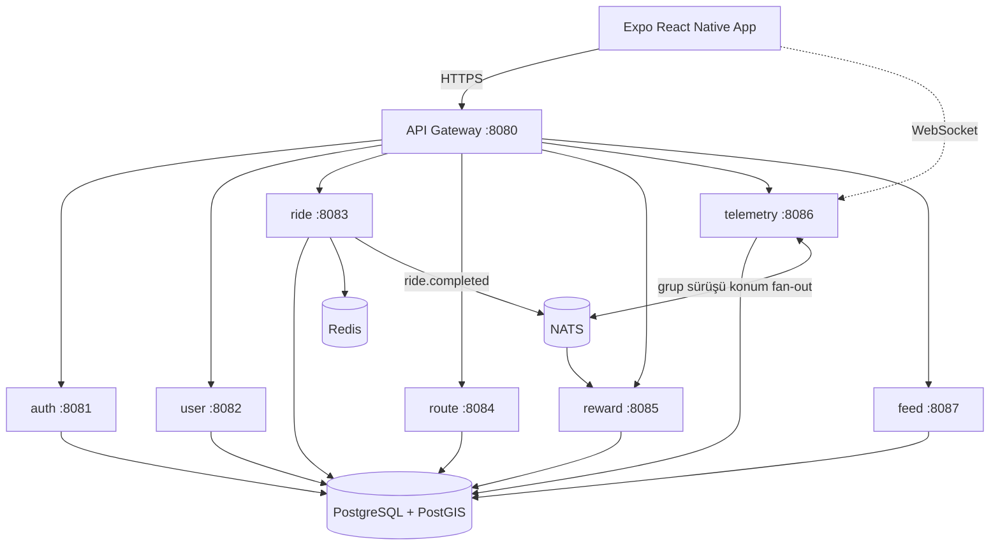

# Morider App

Motosiklet tutkunları için **Strava + Instagram benzeri** bir mobil uygulama: GPS ile sürüş takibi, rota planlama ve paylaşımı, foto akışı, takip (follow) tabanlı sosyal ağ, **canlı grup sürüşü** ve ödül/rozet sistemi.

Bu repo bir **monorepo**'dur:

| Klasör | İçerik |
|--------|--------|
| [`backend/`](backend/) | Go (Gin) mikroservis backend — auth, user, ride, route, reward, telemetry, feed + api-gateway |
| [`mobile/`](mobile/) | Expo (managed) React Native uygulaması |
| [`docs/`](docs/) | Mimari, API tasarımı, sosyal özellikler ve ER diyagram dokümanları |
| [`infra/`](infra/) | Monitoring / yardımcı altyapı konfigürasyonları |

## Özellikler

- **Sürüş takibi** — GPS ile canlı kayıt, mesafe/hız/rota; sürüş geçmişi.
- **Rotalar** — rota oluştur (yol-takipli snap), görünürlük seç (gizli / herkese açık / arkadaşlar), kaydedilen bir rotada sür (haritada rehber çizgi), **GPX içe/dışa aktarma**, **kaydırarak silme**.
- **Keşfet & puanlama** — herkese açık rotaları keşfet, 5 yıldız üzerinden puanla.
- **Foto akışı** — Instagram tarzı çoklu-foto paylaşımları, beğeni & yorum, konum etiketi.
- **Takip sistemi** — tek yönlü takip (profilden veya Keşfet'ten tek dokunuşla); `arkadaşlar` görünürlüğü = **karşılıklı takip**.
- **Canlı grup sürüşü** — kod, **davet linki veya QR kod** ile oturuma katıl (deep link `morider://join/<kod>`, uygulama içi QR tarayıcı), katılımcıların konumunu gerçek zamanlı ortak haritada gör (WebSocket + NATS fan-out). Host **moderasyonu** (at / banla / host devret), tek aktif oturum kuralı, otomatik yeniden bağlanma ve devam eden sürüşe geri dönme.
- **Ödüller** — sürüşlere göre rozetler ve liderlik tablosu.

## Mimari (özet)



> **user** servisi `/api/follows` (takip), **telemetry** `/api/telemetry` (canlı GPS) + `/api/sessions` (grup sürüşü WebSocket), **feed** `/api/feed` + `/api/posts` (foto paylaşımları) rotalarını karşılar.

Detaylar için [`docs/architecture.md`](docs/architecture.md) ve [`docs/social-features.md`](docs/social-features.md).

## Hızlı Başlangıç

### 1. Backend (Docker Compose)

Gereksinim: Docker + Docker Compose.

```bash
cp .env.example .env
make up          # postgis, redis, nats + tüm servisler ayağa kalkar
```

Sağlık kontrolü:

```bash
curl http://localhost:8080/health
```

Örnek auth akışı:

```bash
# Kayıt
curl -X POST http://localhost:8080/api/auth/signup \
  -H 'Content-Type: application/json' \
  -d '{"name":"Umut","email":"umut@example.com","password":"secret123"}'

# Giriş -> token döner
curl -X POST http://localhost:8080/api/auth/login \
  -H 'Content-Type: application/json' \
  -d '{"email":"umut@example.com","password":"secret123"}'

# Token ile sürüş oluştur
curl -X POST http://localhost:8080/api/rides \
  -H 'Authorization: Bearer <TOKEN>' \
  -H 'Content-Type: application/json' \
  -d '{"distance":120.5,"avg_speed":85.0,"elevation_gain":600}'
```

Durdurmak için: `make down`. Komut listesi için: `make help`.

### 2. Mobil (Expo)

Gereksinim: Node.js 18+, Expo Go uygulaması (telefonda) veya bir emülatör.

```bash
cd mobile
npm install
npx expo start
```

> Telefondan test ederken `mobile/.env` içindeki `EXPO_PUBLIC_API_URL` değerini bilgisayarınızın LAN IP'si ile değiştirin (örn. `http://192.168.1.20:8080`).

## Testler

```bash
make backend-test
```

CI (GitHub Actions) her push/PR'da backend testlerini (`go vet` + `go test -race`) ve mobil tip kontrolünü (`tsc --noEmit`) çalıştırır — bkz. [`.github/workflows/ci.yml`](.github/workflows/ci.yml).

## İzleme (Monitoring)

Her servis Prometheus formatında `/metrics` ucu sunar (HTTP istek sayısı, gecikme + Go runtime metrikleri). Compose ile gelen Prometheus arayüzü `http://localhost:9090` üzerindedir; scrape hedefleri [`infra/prometheus.yml`](infra/prometheus.yml) içinde tanımlıdır.

## Lisans

MIT — bkz. [`LICENSE`](LICENSE).
