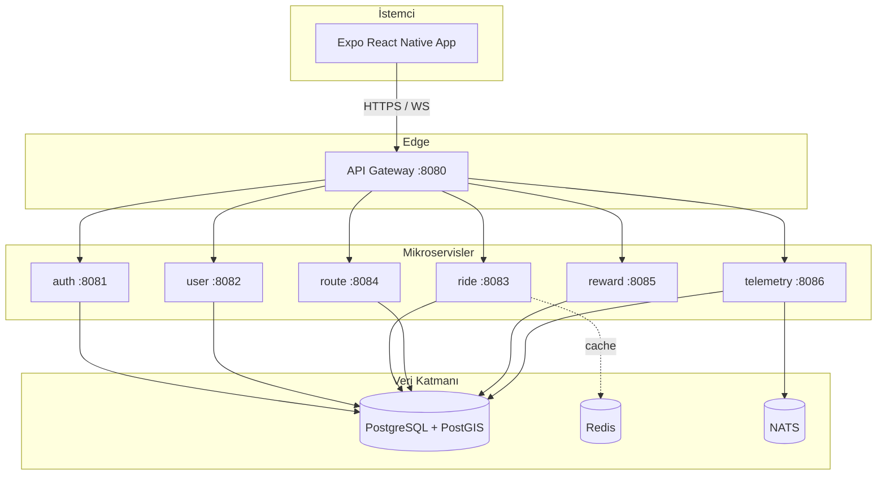

# Mimari

Morider App, bir **Expo (React Native)** istemcisi ile **Go (Gin)** tabanlı mikroservislerden oluşur. Tüm istemci trafiği API Gateway üzerinden geçer; her mikroservis bağımsız bir container olarak çalışır ve ortak bir PostgreSQL + PostGIS veritabanını kullanır.

## Bileşen Diyagramı

## Servis Sorumlulukları

| Servis | Sorumluluk | Önemli uçlar |
|--------|-----------|--------------|
| gateway | Tek giriş noktası, ters proxy | `/api/*` |
| auth | Kayıt/giriş, JWT üretimi | `/api/auth/signup`, `/api/auth/login`, `/api/auth/me` |
| user | Profil okuma/güncelleme | `/api/users/:id` |
| ride | Sürüş CRUD | `/api/rides` |
| route | PostGIS rota CRUD + yola oturtma (OSRM) | `/api/routes`, `/api/routes/plan` |
| reward | Rozet + liderlik tablosu | `/api/rewards`, `/api/leaderboard/top` |
| telemetry | Canlı GPS (WS) + toplu kayıt | `/api/telemetry`, `/api/telemetry/ws` |

## Kararlar

- **Tek Go binary, çok servis:** Tüm servisler `cmd/morider` altındaki tek binary'den `-service=<ad>` bayrağıyla çalışır. docker-compose her servis için aynı imajı farklı bayrakla başlatır. Bu, bağımlılık yönetimini ve build'i basitleştirir; servisler yine de ayrı container/process'ler olarak izole çalışır.
- **PostGIS:** Rotalar `geometry(LineString)`, telemetri noktaları `geography(Point)` olarak saklanır; mesafe `ST_Length(...::geography)` ile hesaplanır.
- **JWT:** HS256, paylaşılan secret. Gateway token'ı doğrulamaz; her servis kendi `AuthMiddleware`'ini uygular (defans-in-depth).
- **NATS:** Telemetri noktaları `telemetry.points`, tamamlanan sürüşler `ride.completed` konusuna yayınlanır. Reward servisi `ride.completed`'ı dinleyip rozet kurallarını otomatik değerlendirir. NATS erişilemezse servisler yine de veriyi kaydeder, yalnız olay akışı durur.
- **Rota motoru:** Route servisi takılabilir bir `Router` arayüzü kullanır; ilk sürücü OSRM'dir (`ROUTING_URL`). Düz-çizgi davranışı korunur, `snap`/`/plan` ile yola oturtulmuş güzergâh ve dönüş-dönüş tarif sağlanır. Ayrıntı: [`routing.md`](routing.md).

## Üretim Notları

MVP'de tek DB + tek replikalı servisler yeterlidir. Ölçeklenirken: servisleri yatay çoğaltma (Kubernetes), Postgres read-replica + PgBouncer, Redis Cluster, NATS JetStream. Detaylar için `Morider-app.md` bölüm 10.
